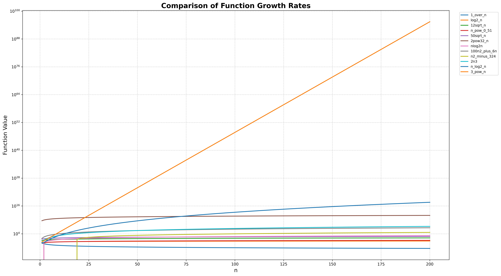

## ✅ Q001 — Put Them in Order
Given a list of mathematical functions, implement a program in **C** to arrange them in **increasing order of asymptotic growth** (Big-O) for sufficiently large values of **n**.

---

## 📈 Growth Comparison Graph

The graph below was generated using the accompanying **Python (Matplotlib)** script from the values produced by the C program.



> **Note:** The Y-axis is plotted on a logarithmic scale so that all functions remain visible on the same graph. Without a log scale, rapidly growing functions such as \(3^n\) would completely dominate the plot.

---

## 📊 Experimental Observations

The generated graph illustrates how each function grows for values of **n = 1 to 200**.

Some functions appear larger than others because of their constant multipliers. For example, **2³²·n** has a very large constant factor, making it much larger than **2n³** within the tested range. However, asymptotic analysis ignores constant factors when considering sufficiently large values of **n**.

Similarly:

- **12√n** and **50√n** belong to the same asymptotic class because they differ only by a constant multiplier.
- **100n² + 6n** and **n² − 324** both have quadratic growth, as lower-order terms and constants become insignificant for large values of **n**.
- **n^0.51** grows slightly faster than **√n**, even though the difference is small over the tested range.

---

## ✅ Increasing Order of Growth

For **sufficiently large values of n**, the functions are ordered as:

1. **1 / n**
2. **log₂(n)**
3. **12√n**
4. **50√n**
5. **n^0.51**
6. **2³² · n**
7. **n log₂(n)**
8. **100n² + 6n**
9. **n² − 324**
10. **2n³**
11. **n^(log₂ n)**
12. **3ⁿ**

---

## 📝 Conclusion

The graph provides an experimental visualization of how the functions behave for finite values of **n**, while the final ordering is determined using **asymptotic analysis (Big-O/Big-Theta)**. Constant multipliers, additive constants and lower-order terms do not affect the long-term growth rate. As a result, the theoretical ordering may differ from the ordering observed for small values of **n**, but it correctly represents the behaviour of the functions as **n → ∞**.
# 📈 Q001 — Put Them in Order


## 📌 Objective

Implement a program in **C** that evaluates a collection of mathematical functions and determines their **increasing order of asymptotic growth** for sufficiently large values of **n**. The program also exports the generated data to a CSV file, which is then visualized using a Python plotting script.

---

## 📂 Project Structure

```text
Q1/
├── main.c                  # Generates function values and prints theoretical ordering
├── main.py                 # Reads CSV and plots the graph
├── q1_data.csv             # Generated experimental data
├── growth_comparison.png   # Graph generated using Matplotlib
└── README.md
```

---

## ⚙️ Functions Analysed

- 1 / n
- log₂(n)
- 12√n
- n^0.51
- 50√n
- 2³² × n
- n log₂(n)
- 100n² + 6n
- n² − 324
- 2n³
- n^(log₂ n)
- 3ⁿ

The C program evaluates each function for **n = 1 to 200** and stores the results in **q1_data.csv**.

---

## 📈 Growth Comparison Graph

The following graph is generated from `q1_data.csv` using **Matplotlib**.


> **Note:** A logarithmic Y-axis is used because functions such as **3ⁿ** and **n^(log₂ n)** become extremely large. Without logarithmic scaling, the remaining curves would be compressed near the x-axis.

---

## 📊 Observations

- **1/n** decreases towards zero as n increases.
- **log₂(n)** grows very slowly.
- **12√n** and **50√n** have identical asymptotic growth and differ only by a constant multiplier.
- **n^0.51** eventually grows faster than √n.
- **2³²·n** appears very large for n ≤ 200 because of its huge constant factor, but it is still a linear function.
- **100n² + 6n** and **n² − 324** are both quadratic functions; constants and lower-order terms do not affect asymptotic growth.
- **n^(log₂ n)** grows faster than every polynomial but slower than exponential functions.
- **3ⁿ** dominates all other functions as n becomes sufficiently large.

---

## ✅ Increasing Order of Growth

| Rank | Function |
|:---:|:---------|
| 1 | 1 / n |
| 2 | log₂(n) |
| 3 | 12√n |
| 4 | 50√n |
| 5 | n^0.51 |
| 6 | 2³² · n |
| 7 | n log₂(n) |
| 8 | 100n² + 6n |
| 9 | n² − 324 |
| 10 | 2n³ |
| 11 | n^(log₂ n) |
| 12 | 3ⁿ |

---

## 🚀 How to Run

### Compile the C Program

```bash
gcc main.c -lm -o main
./main
```

### Generate the Graph

```bash
python3 main.py
```

---

## 📁 Output Files

| File | Description |
|------|-------------|
| `q1_data.csv` | Generated values of all functions for n = 1…200 |
| `growth_comparison.png` | Comparison graph of all functions |

---

## 📝 Conclusion

This experiment combines **theoretical asymptotic analysis** with **experimental visualization**. While the graph illustrates behaviour over a finite range of values, the final ordering is determined by asymptotic growth, where constant multipliers, additive constants and lower-order terms are ignored. This demonstrates why theoretical analysis is essential when comparing algorithmic growth rates.