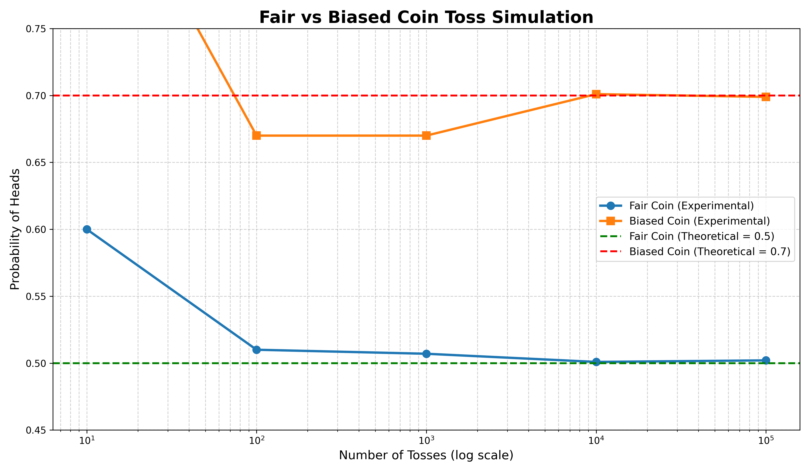

## ✅ Q002 — Fair vs Biased Coin
Simulate a **fair coin toss** in C and verify experimentally that the probability of getting **HEAD** approaches **0.5**. Extend the program to simulate a **biased coin** and compare the observed probabilities.
# 🪙 Q002 — Fair vs Biased Coin Simulation


## 📌 Objective

This experiment simulates both a **fair coin** and a **biased coin** using the C programming language. The objective is to experimentally verify that, as the number of tosses increases, the observed probability of obtaining **Heads** converges to the theoretical probability.

- **Fair Coin:** P(Heads) = **0.5**
- **Biased Coin:** P(Heads) = **0.7**

This behaviour is a practical demonstration of the **Law of Large Numbers**.

---

## 📂 Project Structure

```text
Q2/
├── main.c                  # Coin toss simulation
├── main.py                 # Graph plotting script
├── q2_data.csv             # Experimental data
├── coin_toss_comparison.png# Generated graph
└── README.md
```

---

## ⚙️ Methodology

For each of the following trial counts:

- 10
- 100
- 1,000
- 10,000
- 100,000

The program:

1. Simulates a fair coin.
2. Simulates a biased coin with **P(H)=0.7**.
3. Counts the number of Heads and Tails.
4. Computes the experimental probability of Heads.
5. Stores the results in **q2_data.csv**.
6. Uses **main.py** to generate a comparison graph.

---

## 📈 Result

The graph generated from the CSV data is shown below.



### Observations

- With only **10 tosses**, the experimental probabilities fluctuate significantly due to randomness.
- As the number of tosses increases, the measured probability steadily approaches the theoretical value.
- Around **100,000 tosses**, both simulations are extremely close to their expected probabilities.
- The fair coin converges towards **0.5**, while the biased coin converges towards **0.7**.

This experimentally validates the **Law of Large Numbers**, which states that repeated independent trials converge towards their expected probability.

---

## 📊 Sample Experimental Results

| Trials | Fair Coin P(H) | Biased Coin P(H) |
|-------:|---------------:|-----------------:|
| 10 | 0.60000 | 0.90000 |
| 100 | 0.51000 | 0.67000 |
| 1,000 | 0.50700 | 0.67000 |
| 10,000 | 0.50090 | 0.70100 |
| 100,000 | 0.50205 | 0.69892 |

---

## 📚 Reference

The following paper provides additional theoretical background on estimating the bias of a coin under more advanced probabilistic settings:

- **A Random Coin Tossing Experiment**
  - https://arxiv.org/abs/1709.02362

> **Note:** This laboratory implements a direct Monte Carlo simulation of fair and biased coin tossing. The referenced paper discusses a more advanced statistical setting involving estimation of an unknown coin bias.

---

## 🚀 How to Run

### Compile and Execute

```bash
gcc main.c -o main
./main
```

### Generate the Graph

```bash
python3 main.py
```

---

## ✅ Conclusion

The simulation demonstrates that increasing the number of trials reduces random fluctuations in the observed probabilities. The experimental results closely match the theoretical probabilities of **0.5** and **0.7**, providing a simple yet effective demonstration of probabilistic convergence through simulation.