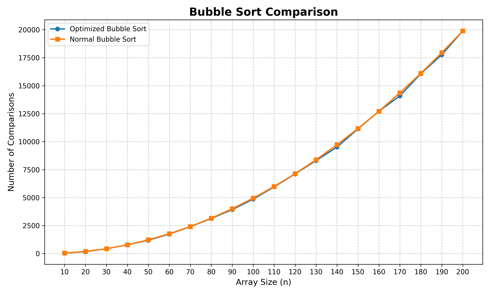

# 🫧 Q003 — Performance Analysis of Bubble Sort

<p align="center">
  
  
  
  
  
  
</p>

---

## 📖 Problem Statement

Implement two versions of **Bubble Sort** for randomized datasets:

- **Optimized Bubble Sort** that terminates early if the array becomes sorted before the **(n − 1)th** pass.
- **Standard Bubble Sort** that always completes all **(n − 1)th** passes.

Plot and compare the **number of comparisons** performed by each algorithm to analyze their efficiency.

---

## 🎯 Objective

- Compare optimized and standard Bubble Sort.
- Measure comparison counts.
- Generate a CSV dataset.
- Visualize results using Python.
- Study the effect of early termination.

---

## 📂 Project Structure

```text
Q3/
├── [main.c](./main.c)          # Bubble Sort implementations
├── [main.py](./main.py)        # Graph plotting script
├── [q3_data.csv](./q3_data.csv)     # Experimental data
├── [q3_graph.png](./q3_graph.png)   # Generated graph
└── [README.md](./README.md)
```

---

## ⚙️ Technologies Used

- 💻 C
- 🐍 Python 3
- 📊 Pandas
- 📈 Matplotlib

---

## 🚀 How to Run

### Compile the C program

```bash
gcc main.c -o main
./main
```

Generates **q3_data.csv**.

### Install Python Libraries

```bash
pip install pandas matplotlib
```

### Plot the Graph

```bash
python3 main.py
```

Generates **q3_graph.png**.

---

## 📊 Output

The experiment records:

- Array Size
- Optimized Bubble Sort Comparisons
- Standard Bubble Sort Comparisons

The generated CSV is used by **main.py** to create a comparison graph.

### 📉 Generated Performance Graph

<p align="center">
  <a href="./q3_graph.png">
    
  </a>
</p>

> 💡 Click the graph to view it in full resolution.

---

## 🧠 Time Complexity

| Algorithm | Best | Average | Worst |
|-----------|:----:|:-------:|:-----:|
| Optimized Bubble Sort | **O(n)** | **O(n²)** | **O(n²)** |
| Standard Bubble Sort | **O(n²)** | **O(n²)** | **O(n²)** |

---

## 📈 Observation

- Both algorithms exhibit **O(n²)** worst-case behavior.
- Early termination reduces unnecessary comparisons when the array becomes sorted before the final pass.
- For random inputs, the optimized version consistently performs the same or fewer comparisons.

---


## 🔗 Quick Links

- 📄 [Source Code (main.c)](./main.c)
- 🐍 [Python Plotter (main.py)](./main.py)
- 📊 [Experimental Dataset (q3_data.csv)](./q3_data.csv)
- 🖼️ [Generated Graph (q3_graph.png)](./q3_graph.png)
- 📘 [Project Documentation (README.md)](./README.md)

## 🏷️ Tags

`Algorithms` `DAA` `Bubble Sort` `Performance Analysis` `Sorting Algorithms` `C` `Python` `CSV` `Pandas` `Matplotlib` `Data Visualization`

---

<div align="center">

### ⭐ Design and Analysis of Algorithms — Lab 1

*Performance Analysis of Bubble Sort using C and Python*

</div>