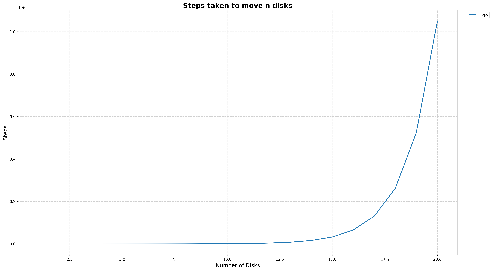

# 🗼 Towers of Hanoi (ToH) – Lab 1 Question 4

<div align="center">


-orange?style=for-the-badge)

</div>

---

## 📖 Problem Statement

> **Simulate the solution to the Towers of Hanoi (ToH) problem using C. Plot the total number of moves required for solving the problem for _n_ disks. What can you conclude about the algorithm from the obtained plot?**

---

## 📂 Project Structure

```text
Q4/
├── 📄 main.c
├── 🐍 main.py
├── 📊 steps_count.csv
├── 🖼️ steps_graph.png
└── 📘 README.md
```

---

## ⚙️ Implementation

### 🧠 C Program

The C program:

- Implements the recursive Towers of Hanoi algorithm.
- Uses a global `steps` counter to count every disk movement.
- Generates move counts for every value of **n** from **1** to the user-provided limit.
- Stores the results in **steps_count.csv**.

Recursive relation:

```text
T(n) = 2T(n-1) + 1
```

Base case:

```text
T(0) = 0
```

---

### 📊 Python Visualization

The Python script:

- Reads `steps_count.csv` using **Pandas**.
- Plots the number of steps against the number of disks.
- Adds labels, legend, grid and title.
- Saves the graph as **steps_graph.png**.

### 🔗 Project Files

| File | Description |
|------|-------------|
| 📄 **[main.c](./main.c)** | Recursive Towers of Hanoi implementation in C |
| 🐍 **[main.py](./main.py)** | Generates the graph from the CSV data |
| 📊 **[steps_count.csv](./steps_count.csv)** | Contains the generated move counts |
| 🖼️ **[steps_graph.png](./steps_graph.png)** | Graph generated by the Python script |

---

## ▶️ How to Run

### Compile

```bash
gcc main.c -o toh
```

### Execute

```bash
./toh
```

### Generate Graph

```bash
python3 main.py
```

---

---

## 📉 Generated Graph

The following graph is produced automatically by **[main.py](./main.py)** using the data stored in **[steps_count.csv](./steps_count.csv)**.

<p align="center">
  <a href="./steps_graph.png">
    
  </a>
</p>

> Click the image above to view the graph in full resolution on GitHub.

## 📈 Sample Output

| Disks (n) | Steps |
|-----------|------:|
| 1 | 1 |
| 2 | 3 |
| 3 | 7 |
| 4 | 15 |
| 5 | 31 |
| 10 | 1023 |
| 20 | 1048575 |

The generated CSV follows the sequence:

```text
1
3
7
15
31
63
127
...
```

which is exactly:

```text
2^n - 1
```

---

## 📐 Time Complexity

| Operation | Complexity |
|-----------|------------|
| Recursive Algorithm | **O(2^n)** |
| Auxiliary Space | **O(n)** |

---

## 📌 Conclusion

From the plotted graph, the number of moves increases exponentially as the number of disks increases.

Since

```text
Steps = 2^n - 1
```

- Every additional disk nearly doubles the number of required moves.
- The recursive solution has **exponential time complexity**.
- The growth becomes extremely steep even for moderate values of **n**, making the algorithm impractical for large inputs.

Thus, the graph clearly demonstrates the exponential growth of the Towers of Hanoi algorithm.

---

## 🛠️ Technologies Used

- C
- Python
- Pandas
- Matplotlib
- CSV
- Recursion

---

## 🏷️ Tags

`C` `Recursion` `Towers of Hanoi` `Algorithm Analysis` `DAA` `Lab 1` `Matplotlib` `Pandas` `CSV` `Time Complexity` `O(2^n)` `Data Visualization`