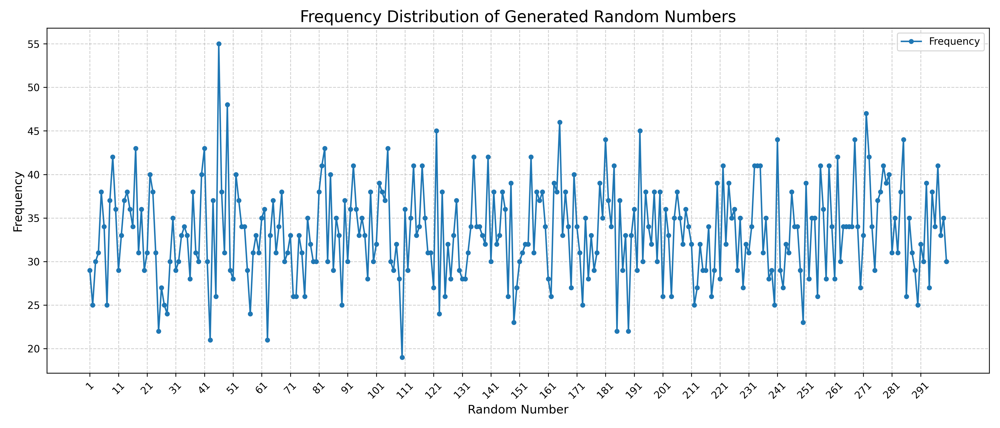

# 🚀 Lab 1 – Question 6: Element Uniqueness

<p align="center">
  
  
  
  
</p>

<p align="center">
  Detect duplicates efficiently using a <b>Frequency Array</b>, export the results to <b>CSV</b>, and visualize the distribution using <b>Python + Matplotlib</b>.
</p>

---

## 📖 Problem Statement

> **Element Uniqueness:** For given **n** random numbers, implement a method in **C** to check if there are any duplicates. What can you conclude about your method for a sufficiently large value of **n**?

---

## 💡 Approach

- Generate **n** random numbers within a user-defined range.
- Store the frequency of each number using a dynamically allocated frequency array.
- If any frequency becomes greater than **1**, a duplicate exists.
- Export the frequency table to a CSV file.
- Use Python and Matplotlib to visualize the frequency distribution.

### ⏱️ Complexity

| Operation | Complexity |
|-----------|-----------:|
| Frequency Counting | **O(n)** |
| Duplicate Detection | **O(n)** |
| Extra Space | **O(R)** (where *R* is the range of numbers) |

---

## 📂 Project Structure

```text
Q6/
├── main.c                      # C implementation
├── main.py                     # Python plotting script
├── README.md                   # Documentation
├── randoms_count.csv           # Generated CSV data
└── frequency_distribution.png  # Output graph
```

| File | Description |
|------|-------------|
| [`main.c`](./main.c) | Generates random numbers, builds the frequency array, and exports the CSV |
| [`main.py`](./main.py) | Reads the CSV and generates the visualization |
| [`randoms_count.csv`](./randoms_count.csv) | Frequency data generated by the C program |
| [`frequency_distribution.png`](./frequency_distribution.png) | Final visualization |
| [`README.md`](./README.md) | Project documentation |

---

## ▶️ How to Run

### 1️⃣ Clone the Repository

```bash
git clone <repository-url>
cd LAB1/Q6
```

### 2️⃣ Compile the C Program

```bash
gcc main.c -o q6
```

### 3️⃣ Execute the Program

```bash
./q6
```

The program will:

- Ask for the lower and upper limits.
- Ask how many random numbers should be generated.
- Generate the random numbers.
- Count the frequency of each number.
- Create **randoms_count.csv**.

### 4️⃣ Generate the Graph

Install the required library (only once):

```bash
pip install pandas matplotlib
```

Then run:

```bash
python3 main.py
```

This generates:

- 📄 `randoms_count.csv`
- 📈 `frequency_distribution.png`

---

## 📸 Sample Output

### Generated Frequency Graph

<p align="center">
  
</p>

The graph illustrates the frequency of every generated random number within the selected range.

---

## 📌 Conclusion

Using a frequency array allows duplicate detection in **linear time, O(n)**. Since each generated number is processed exactly once, the algorithm scales efficiently even for large values of **n** (provided the range is reasonably bounded). Compared to the naive **O(n²)** pairwise comparison approach, this method is significantly faster and more practical.

---

## 🏷️ Tags

`C` `Python` `DAA` `Algorithms` `Random Number Generation` `Frequency Array` `Duplicate Detection` `CSV` `Matplotlib` `Data Visualization` `Time Complexity` `Lab 1`