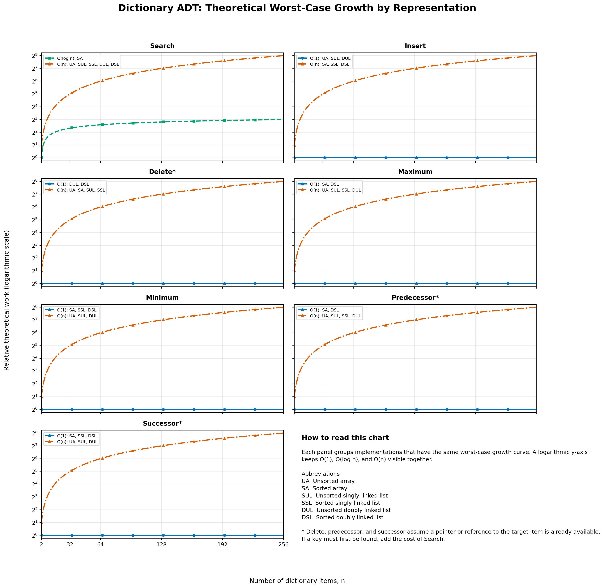

# 📚 Q1 — Dictionary Operations

<div align="center">


</div>

> Implement the same dictionary ADT with six array and linked-list representations, then compare their worst-case costs.

[← Lab 02](../README.md) · [Lab sheet (PDF)](../2026_Week2_DAA_Lab_02.pdf) · [Next: Q2 →](../Q2/README.md)

**Tags:** `#C` `#Python` `#Git` `#GitHub` `#DAA` `#DictionaryADT` `#Arrays` `#LinkedLists` `#AsymptoticAnalysis`

## Problem

Implement the dictionary ADT using six data structures and compare the worst-case running times of:

`Search`, `Insert`, `Delete`, `Maximum`, `Minimum`, `Predecessor`, and `Successor`.

For `Delete`, `Predecessor`, and `Successor`, the analysis follows the question's convention: the operation is given a pointer/reference to the target item `x`. The interactive programs ask for a key, use `Search` to obtain that item, and then perform the pointer-based operation.

## Implementations

| Folder | Representation | Source | Documentation |
|---|---|---|---|
| `01_unsortedList` | Unsorted array | [main.c](01_unsortedList/main.c) | [README](01_unsortedList/README.md) |
| `02_sortedList` | Sorted array | [main.c](02_sortedList/main.c) | [README](02_sortedList/README.md) |
| `03_singlyLinkedUnsortedList` | Unsorted singly linked list | [main.c](03_singlyLinkedUnsortedList/main.c) | [README](03_singlyLinkedUnsortedList/README.md) |
| `04_singlyLinkedSortedList` | Sorted singly linked list | [main.c](04_singlyLinkedSortedList/main.c) | [README](04_singlyLinkedSortedList/README.md) |
| `05_doublyLinkedUnsortedList` | Unsorted doubly linked list | [main.c](05_doublyLinkedUnsortedList/main.c) | [README](05_doublyLinkedUnsortedList/README.md) |
| `06_doublyLinkedSortedList` | Sorted doubly linked list | [main.c](06_doublyLinkedSortedList/main.c) | [README](06_doublyLinkedSortedList/README.md) |

## Worst-Case Running Times

Let `n` be the number of items in the dictionary.

| Representation | Search | Insert | Delete* | Max | Min | Predecessor* | Successor* |
|---|---:|---:|---:|---:|---:|---:|---:|
| Unsorted array | `O(n)` | `O(1)` | `O(n)` | `O(n)` | `O(n)` | `O(n)` | `O(n)` |
| Sorted array | `O(log n)` | `O(n)` | `O(n)` | `O(1)` | `O(1)` | `O(1)` | `O(1)` |
| Unsorted singly linked list | `O(n)` | `O(1)` | `O(n)` | `O(n)` | `O(n)` | `O(n)` | `O(n)` |
| Sorted singly linked list | `O(n)` | `O(n)` | `O(n)` | `O(n)` | `O(1)` | `O(n)` | `O(1)` |
| Unsorted doubly linked list | `O(n)` | `O(1)` | `O(1)` | `O(n)` | `O(n)` | `O(n)` | `O(n)` |
| Sorted doubly linked list | `O(n)` | `O(n)` | `O(1)` | `O(1)` | `O(1)` | `O(1)` | `O(1)` |

\* `Delete`, `Predecessor`, and `Successor` assume a pointer/reference to the item is already available. If the key must first be searched, add the cost of `Search`.

## Build and Run

Compile from any implementation folder:

```bash
cc -std=c11 -Wall -Wextra -Werror main.c -o dictionary
./dictionary
```

## Growth-Order Validation

To plot the expected growth, run each operation for progressively larger values of `n` and record its runtime or operation count. The expected curves are:

- `O(1)`: approximately flat
- `O(log n)`: slowly increasing
- `O(n)`: approximately a straight line

Use a worst-case input for each measurement: for example, search for a missing key, insert at the beginning of a sorted array/list, and delete the first item of an array.

## Complexity Visualization

The following chart makes the worst-case comparison visual. It plots relative theoretical work for every operation and groups implementations only when their curves are exactly the same. The logarithmic vertical scale keeps `O(1)`, `O(log n)`, and `O(n)` visible in the same panel.

[](dictionary_time_complexity.png)

Generate or refresh the chart from this directory:

```bash
python3 -m pip install matplotlib
python3 plot_time_complexity.py
```

The script writes [dictionary_time_complexity.png](dictionary_time_complexity.png) beside itself. It models the asymptotic worst-case bounds in the table above, so it is a theory visualization rather than a machine-dependent benchmark. For `Delete`, `Predecessor`, and `Successor`, it uses the same already-available pointer/reference convention as the table.
