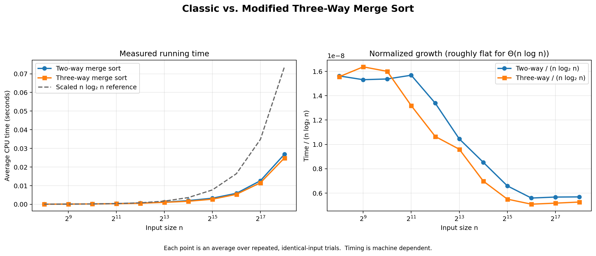
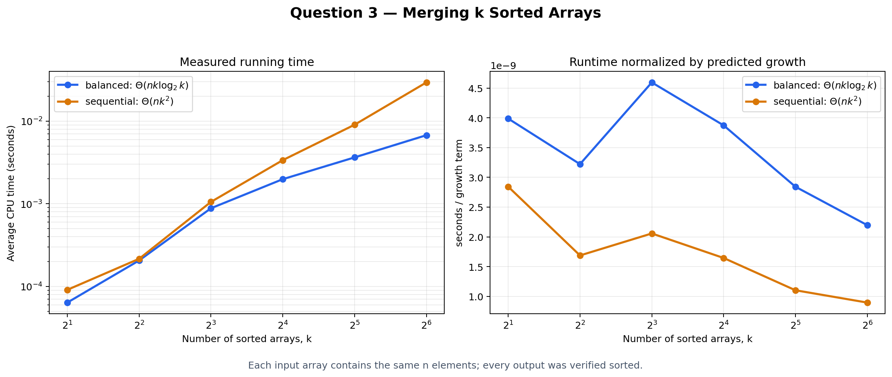

# 🚀 Design and Analysis of Algorithms

<div align="center">


### B.Tech CSE · Semester 3 · DAA Laboratory

</div>

> A collection of Design and Analysis of Algorithms laboratory work: C implementations, Python benchmark tools, result data, graphs, and short explanations for every completed question.
****
## 📍 Quick navigation

| Lab | Lab sheet | Topics | Open |
| --- | --- | --- | --- |
| **Lab 01** | [Week 1 assignment PDF](LAB1/2026_Week1_DAA_Lab_01.pdf) | Growth, simulation, sorting, recursion, search | [Lab 01 README](LAB1/README.md) |
| **Lab 02** | [Week 2 assignment PDF](LAB2/2026_Week2_DAA_Lab_02.pdf) | Dictionaries, merge sort, merging sorted arrays | [Lab 02 README](LAB2/README.md) |

## 📈 Progress

```text
Lab 01  ████████████████████  100%  6 / 6 questions
Lab 02  ████████████████████  100%  3 / 3 questions
──────────────────────────────────────────────────────
Current work  ████████████████████  100%  2 completed labs · 9 questions
```

| Area | Status | Evidence |
| --- | :---: | --- |
| C implementations | ✅ Complete | Every completed question has a linked `main.c`. |
| Experimental data | ✅ Available | CSV files accompany benchmark-based questions. |
| Visual analysis | ✅ Available | Complexity and comparison charts are saved as PNG files. |
| Lab sheets | ✅ Linked | Both original assignment PDFs are available above. |

## 🧪 Lab 01 — Foundations

**Lab sheet:** [2026 Week 1 — DAA Lab 01](LAB1/2026_Week1_DAA_Lab_01.pdf) · **Full documentation:** [LAB1/README.md](LAB1/README.md)

| # | Question | Key idea | Files / result |
| :---: | --- | --- | --- |
| 1 | [Order of growth](LAB1/Q1/README.md) | Compare asymptotic growth functions | [C](LAB1/Q1/main.c) · [graph](LAB1/Q1/growth_comparison.png) |
| 2 | [Coin-toss simulation](LAB1/Q2/README.md) | Fair vs. biased probability experiment | [C](LAB1/Q2/main.c) · [graph](LAB1/Q2/coin_toss_comparison.png) |
| 3 | [Bubble-sort analysis](LAB1/Q3/README.md) | Measure sorting behaviour | [C](LAB1/Q3/main.c) · [graph](LAB1/Q3/q3_graph.png) |
| 4 | [Towers of Hanoi](LAB1/Q4/README.md) | Recursive solution and step count | [C](LAB1/Q4/main.c) · [graph](LAB1/Q4/steps_graph.png) |
| 5 | [Partition point](LAB1/Q5/README.md) | Locate a transition efficiently | [C](LAB1/Q5/main.c) |
| 6 | [Element uniqueness](LAB1/Q6/README.md) | Frequency-based analysis | [C](LAB1/Q6/main.c) · [graph](LAB1/Q6/frequency_distribution.png) |

## ⚙️ Lab 02 — Data Structures and Merging

**Lab sheet:** [2026 Week 2 — DAA Lab 02](LAB2/2026_Week2_DAA_Lab_02.pdf) · **Full documentation:** [LAB2/README.md](LAB2/README.md)

| # | Question | Key result | Files / result |
| :---: | --- | --- | --- |
| 1 | [Dictionary implementations](LAB2/Q1/README.md) | Compare array and linked-list dictionary choices | [implementations](LAB2/Q1/README.md) · [graph](LAB2/Q1/dictionary_time_complexity.png) |
| 2 | [Two-way vs. three-way merge sort](LAB2/Q2/README.md) | Both methods are `Θ(n log n)` | [C](LAB2/Q2/main.c) · [data](LAB2/Q2/data/benchmark_results.csv) · [graph](LAB2/Q2/plots/merge_sort_complexity.png) |
| 3 | [Merge `k` sorted arrays](LAB2/Q3/README.md) | Balanced merge: `Θ(nk log k)` vs. sequential: `Θ(nk²)` | [sequential C](LAB2/Q3/01_sequentialMerge/main.c) · [balanced C](LAB2/Q3/02_balancedPairwiseMerge/main.c) · [graph](LAB2/Q3/merge_k_arrays_complexity.png) |

### Featured benchmark results

<table>
  <tr>
    <td align="center"><a href="LAB2/Q2/README.md"><strong>Q2 — Merge sort comparison</strong></a><br><br></td>
    <td align="center"><a href="LAB2/Q3/README.md"><strong>Q3 — k-array merge comparison</strong></a><br><br></td>
  </tr>
</table>

## 📁 Repository structure

```text
DAA/
├── LAB1/
│   ├── 2026_Week1_DAA_Lab_01.pdf   Assignment sheet
│   ├── Q1/ … Q6/                   Programs, data, graphs, and READMEs
│   └── README.md
├── LAB2/
│   ├── 2026_Week2_DAA_Lab_02.pdf   Assignment sheet
│   ├── Q1/                         Dictionary implementations
│   ├── Q2/                         Two-way vs. three-way merge sort
│   ├── Q3/                         Sequential vs. balanced k-array merge
│   └── README.md
└── README.md                        You are here
```

## 🛠️ Tools used

- **C11** with `cc`/GCC for algorithm implementations
- **Python 3** for benchmark data collection and plotting
- **matplotlib** for visual complexity analysis
- **Git and GitHub** for version control

Most questions can be built with `cc -std=c11 -Wall -Wextra main.c -o program`. Exact commands, expected output, and data/graph links are in each question README.

## 🏷️ Tags

`design-and-analysis-of-algorithms` `daa` `algorithms` `data-structures` `asymptotic-analysis` `divide-and-conquer` `merge-sort` `recursion` `benchmarking` `c-programming` `python` `matplotlib` `btech-cse` `semester-3`

<div align="center">

**Explore a lab, run an algorithm, and follow the data to the graph. 📊**

</div>
